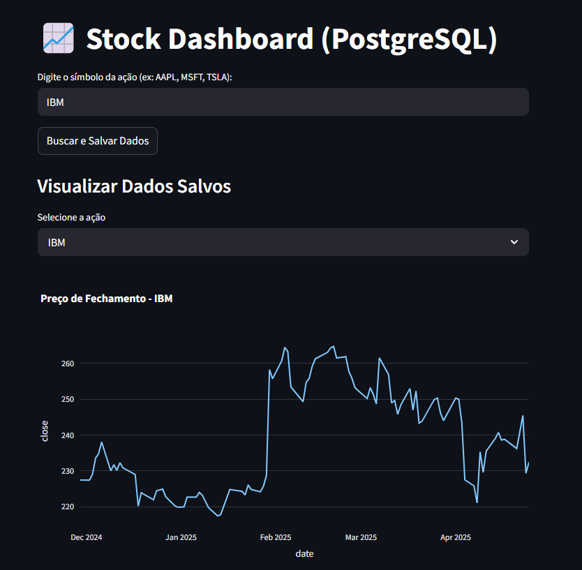

# 📈 Projeto: Analisador de Ações com Streamlit, Alpha Vantage e PostgreSQL

Este projeto é uma aplicação interativa desenvolvida em **Python** utilizando **Streamlit**, que permite:
- Buscar cotações históricas de ações pela **API Alpha Vantage**.
- Armazenar os dados em um **banco de dados PostgreSQL**.
- Visualizar gráficos de preços diretamente na interface web.

---

## 🚀 Tecnologias utilizadas

- [Python 3.10+](https://www.python.org/)
- [Streamlit](https://streamlit.io/)
- [Alpha Vantage API](https://www.alphavantage.co/)
- [PostgreSQL](https://www.postgresql.org/)
- [SQLAlchemy](https://www.sqlalchemy.org/)
- [Pandas](https://pandas.pydata.org/)
- [psycopg2](https://www.psycopg.org/)

---

## 🎯 Funcionalidades

- 🔍 Busca de ações via seleção de símbolo (com autocomplete).
- 📊 Visualização de preços históricos.
- 🗄️ Armazenamento seguro dos dados no PostgreSQL.
- 📈 Gráficos automáticos em tempo real.

---

## 🛠️ Instalação

1. Clone o repositório:

```bash
git clone https://github.com/seu-usuario/seu-repo.git
cd seu-repo
```

2. Crie um ambiente virtual e ative

```bash
python -m venv venv
venv\Scripts\activate  # Windows
source venv/bin/activate  # Linux/Mac
```

3. Instale as dependências:

```bash
pip install -r requirements.txt
```

4. Configure o PostgreSQL:
    - Crie um DB
    - Defina as variáveis de conexão

5. Obtenha uma chave da Alpha Vantage (gratuita) e insira em ETL.py:
```python
API_KEY=SUA_CHAVE
```

---

## 🖥️ Como Rodar

1. Rode o app.py

```bash
streamlit run app.py
```

2. Abra no navegador ou no streamlit

---

## 📷 Prints e demo do projeto




---